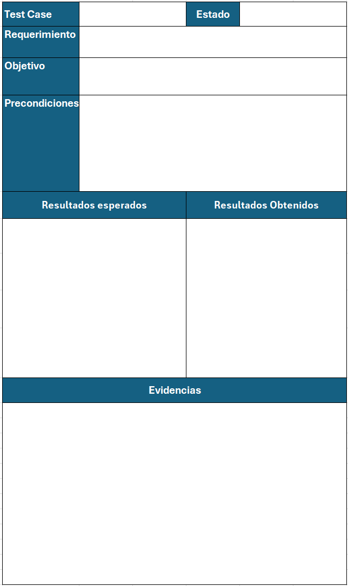
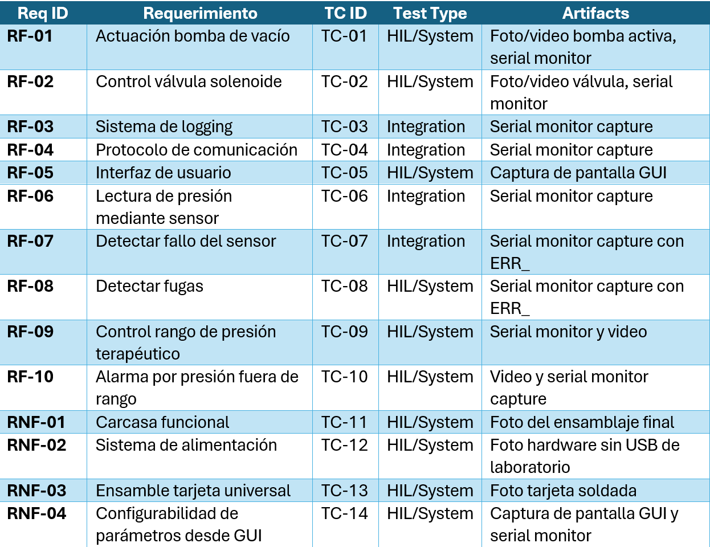

# Requerimientos
## Requerimientos funcionales
### RF-01: Actuación bomba de vacío
El sistema debe controlar la bomba de vacío mediante una señal PWM generada por el ESP32 a través de un MOSFET. La bomba debe activarse y desactivarse según la lógica de control de presión del firmware.
Prueba TC-01:
Conectar el sistema completo y encenderlo. Verificar que el firmware registra el activado y desactivado la bomba y verificar físicamente que la bomba responde a las señales de control.
### RF-02: Control válvula solenoide
El sistema debe controlar la apertura y cierre de la válvula solenoide mediante una señal digital del ESP32. La válvula debe responder a las decisiones del firmware basadas en la lectura de presión.
Prueba TC-02:
Encender el sistema y verificar físicamente la respuesta mecánica de la válvula mientras esta siendo correctamente registrado en el firmware.
### RF-03: Sistema de logging
El sistema debe implementar un módulo de logging por UART que incluya timestamp, niveles de severidad (INFO, WARN, ERROR) y códigos de error estructurados. Todos los eventos relevantes del sistema deben registrarse con su nivel correspondiente.
Prueba TC-03:
Encender el sistema y abrir el monitor serial a la velocidad configurada. Verificar que cada mensaje de log incluye timestamp, nivel de severidad y descripción del evento. Inducir un error y verificar que aparece con nivel ERROR y código estructurado.
### RF-04: Protocolo de comunicación
El sistema debe implementar al menos dos protocolos de comunicación digital. Para cada protocolo implementado se debe especificar velocidad, configuración y justificación técnica de su selección.
Prueba TC-04:
Verificar en el código fuente y en la documentación que están implementados al menos dos protocolos. Para cada uno, confirmar que los parámetros de configuración están definidos y que el sistema opera correctamente a través de ellos.
### RF-05: Interfaz de usuario
El sistema debe contar con un display físico que muestre en tiempo real el valor de presión medido, el estado del sistema (bomba, válvula), y cualquier error o alarma activa.
Prueba TC-05:
Encender el sistema y verificar que el display muestra el valor de presión actualizado, el estado de la bomba y la válvula. Inducir un error y verificar que el display lo refleja correctamente.
### RF-06: Lectura de presión mediante sensor
El sistema debe leer la presión del sensor MPX mediante el ADC del ESP32 cada 500 ms. La variable medida es presión en mmHg, con rango esperado de -125 mmHg a 0 mmHg. El valor leído debe registrarse por logging en cada ciclo.
Prueba TC-06:
Encender el sistema con el sensor conectado y verificar que aparece una lectura de presión cada 500 ms dentro del rango esperado, con nivel INFO.
### RF-07: Detección de fallo del sensor
El sistema debe detectar cuando el sensor MPX entrega un valor fuera del rango válido del ADC o un valor inconsistente, y registrar el código de error ERR_SENSOR_OUT_OF_RANGE por UART con nivel ERROR.
Prueba TC-07:
Desconectar el sensor MPX con el sistema encendido. Verificar que el serial monitor muestra [ERROR] ERR_SENSOR_OUT_OF_RANGE y que el display refleja el estado de fallo.
### RF-08: Detección de fugas
El sistema debe detectar una condición de fuga cuando la presión no alcanza el valor objetivo dentro de un tiempo máximo definido con la bomba activa. Ante esta condición debe registrar ERR_PRESSURE_LEAK con nivel ERROR y desactivar la bomba.
Prueba TC-08:
Encender el sistema y simular una fuga dejando el circuito de vacío intencionalmente abierto. Verificar que tras el tiempo máximo definido aparece [ERROR] ERR_PRESSURE_LEAK en el serial monitor y  que la bomba se desactiva.
### RF-09: Control de rango de presión terapéutico
El sistema debe mantener la presión dentro del rango terapéutico definido de -80 mmHg a -125 mmHg activando y desactivando la bomba y la válvula según la lectura del sensor.
Prueba TC-09:
Encender el sistema en modo terapéutico y verificar por serial monitor que la presión se mantiene dentro del rango definido. Verificar que la bomba se activa cuando la presión supera -80 mmHg y se desactiva al alcanzar -125 mmHg.
### RF-10: Alarma por presión fuera de rango
El sistema debe activar una alarma visual en el display y registrar [WARN] ERR_PRESSURE_OUT_OF_RANGE cuando la presión medida se encuentre fuera del rango terapéutico por más de un tiempo definido.
Prueba TC-10:
Con el sistema encendido, forzar una condición de presión fuera de rango (desconectando la bomba o abriendo el circuito). Verificar que el display muestra la alarma y el serial monitor registra el evento con nivel WARN.
## Requerimientos no funcionales
### RNF-01: Carcasa funcional
El sistema debe estar contenido dentro de una carcasa funcional que proteja los componentes electrónicos, permita acceso a los conectores necesarios y sea adecuada para una demostración segura.
Prueba TC-11:
Verificar físicamente que todos los componentes están dentro de la carcasa, que los conectores de alimentación, sensor y actuadores son accesibles, y que el display es visible desde el exterior.
### RNF-02: Sistema de alimentación autónoma
El sistema debe operar con una fuente DC 12V externa, suministrando el voltaje y corriente necesarios para todos los componentes durante la demostración.
Prueba TC-12:
Conectar únicamente la fuente DC 12V externa, sin ninguna conexión a la fuente del laboratorio ni USB de programación. Verificar que el sistema enciende, inicializa correctamente y opera sin interrupciones.
### RNF-03: Ensamble en tarjeta universal
El sistema debe estar ensamblado en una tarjeta universal soldada y debe existir un diagrama esquemático documentado del circuito.
Prueba TC-13:
Verificar físicamente que el circuito está completamente soldado en tarjeta universal. Verificar que existe el diagrama esquemático en el repositorio de GitHub.
### RNF-04: Configurabilidad de parámetros desde GUI
El sistema debe permitir al usuario configurar desde el display físico parámetros como presión objetivo tiempo de terapia y tiempo máximo de espera antes de detectar fuga, sin necesidad de recompilar el firmware.
Prueba TC-14:
Con el sistema encendido, navegar el menú del display y modificar el valor de los parametros objetivo. Verificar por serial monitor que el sistema adopta el nuevo valor y opera con el parámetro actualizado.
## Plantilla requerimientos

## Matriz

